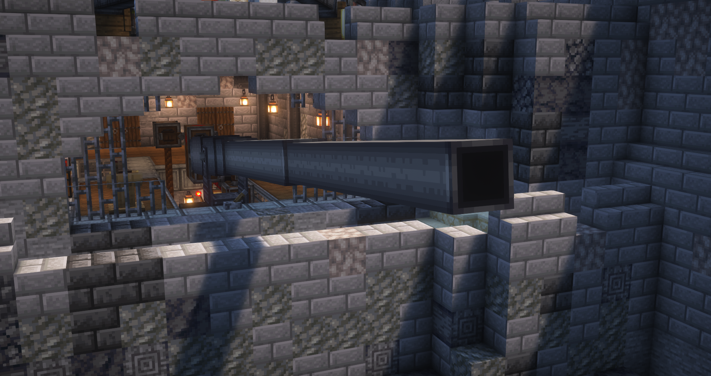
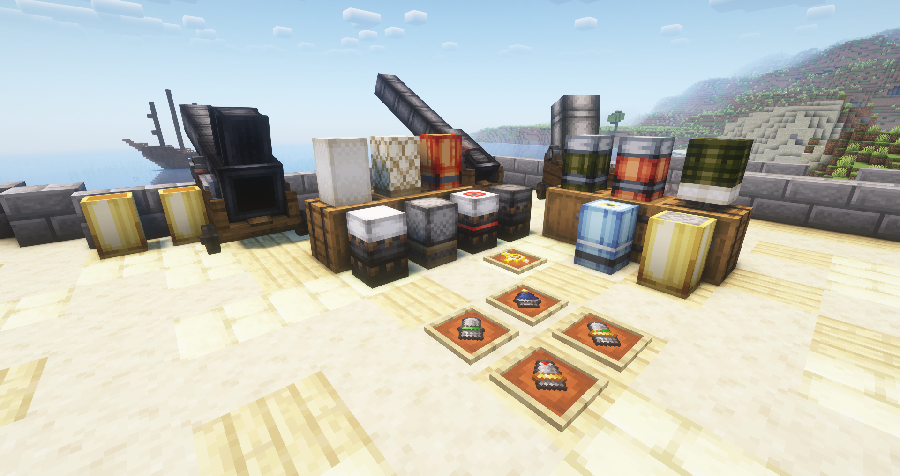
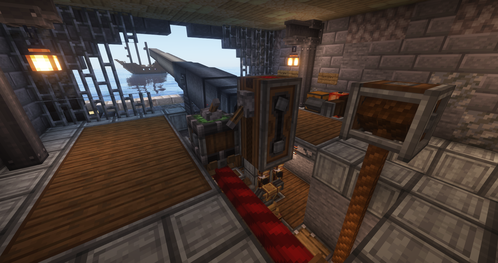
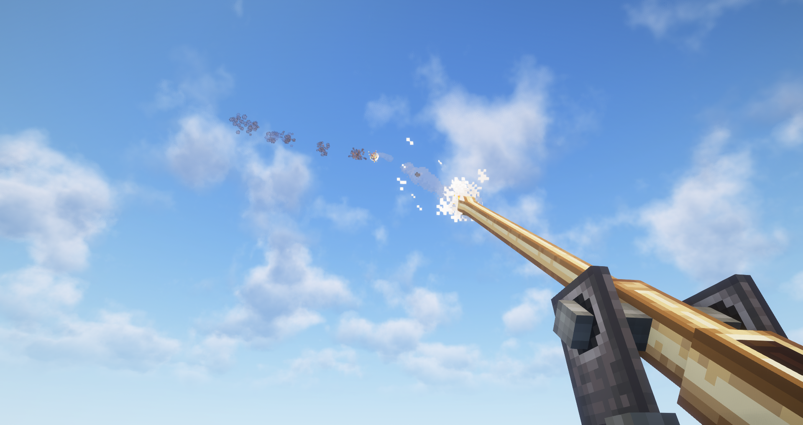

# Create Big Cannons

[![Modrinth](https://img.shields.io/badge/dynamic/json?labelColor=black&color=grey&label=&suffix=%20downloads&query=downloads&url=https://api.modrinth.com/v2/project/GWp4jCJj&style=flat&logo=data:image/png;base64,iVBORw0KGgoAAAANSUhEUgAAACAAAAAgCAMAAABEpIrGAAAAIGNIUk0AAHomAACAhAAA+gAAAIDoAAB1MAAA6mAAADqYAAAXcJy6UTwAAAJPUExURQAAABvZahWnUha1WAYzGQlHIxvZahvZahvZahvZahvZahvZahvZahvZahvZahvZahvZahvZahvZahvZahvZahvZahvZahvZahvZahvZahvZahvZahvZahvZahvZahvZahvZahvZahvZahvZahvZahvZahvZahvZahvZahvZahvZahvZahvZahvZahvZahvZahvZahvZahvZahvZahvZahvZahvZahvZahvZahvZahvZahvZahvZahvZahvZahvZahvZahvZahvZahvZahvZahvZahvZahvZahvZahvZahvZahvZahvZahvZahvZahvZahvZahvZahvZahvZahvZahvZahvZahvZahvZahvZahvZahvZahvZahvZahvZahvZahvZahvZahvZahvZahvZahvZahvZahvZahvZahvZahvZahvZahvZahvZahvZahvZahvZahvZahvZahvZahvZahvZahvZahvZahvZahvZahvZahvZahvZahvZahvZahvZahvZahvZahvZahvZahvZahvZahvZahvZahvZahvZahvZahvZahvZahvZahvZahvZahvZahvZahvZahvZahvZahvZahvZahvZahvZahvZahvZahvZahvZahvZahvZahvZahvZahvZahvZahvZahvZahvZahvZahvZahvZahvZahvZahvZahvZahvZahvZahvZahvZahvZahvZahvZahvZahvZahvZahvZahvZahvZahvZahvZahvZahvZahvZahvZahvZahvZahvZahvZav///9ScwmYAAADDdFJOUwAAAAAAAA8zW3uOYwIBK3rB6Pn+ml18KiGL5HEDquOIH07R/UzKz2zu+uLHIibtafWkVCMNBRqg7/RQuT8EQbvT+5ETDBSU/NAgCSdZlcQKii7mtxJY5fF/7D1SRkB+EcWh4UilOOtPMdTCR1PqN969vmGDCw7G4DSSsAcGHrSPr3bds5CEwDKoXumcZdwcG4KmjayX32A79pjOqRjIFoXynVYVgPi6qxDnL78p2obVJFquNbGZCPdyvHPZ1yhuh8s+iRzcsrEAAAABYktHRMQUDBvhAAAAB3RJTUUH5wQXDwgZWDUtiQAAAqRJREFUOMttU/k7lFEU/k4L4hsxtNAnhRgiJZOiSfbI2oJpmRFCi2kV0aaNVLTIEpVISmnf97r/WO+534yZnqfzw73vOe+559xz7rmKIoVYvLx95vj6qUSqVBW3sGrwnxsQaAwSwcDz5i9g0wxPfmFIqJCyiEgLE4vDl7iD8PGlETotIqOQahlAdJTLA5sWY5JsbNzysHiihEBWViRqRDOlgyFmJVtMq5JWJ5vhvyZlLevrEmUILKl8PihtvYWcYt6QLmNwFjjEb4SSkZnlZLO5yJzcPBg35bODwZfPZxYwWbC5sKjYzwBUkssxSg1wKNsCtHUb89vTy3GwopBxDmcJ9YdDJYB1B9t2WmUtcbtkqt18Mxsp9irsezS2VEu+uka/mqUWSrFd2VsnhLEetoZ9TFv3HwCexdUdjBWi0aH4YTuEvtoPM3/EO1nnuTpEjD2qHIM54DhR0wmA5hZySzIntyknsbZyi8IB0tp07tRpBDKfgeWsdDjHDlFGRIjnl3O0t573gcMFUBeVS1gvlxB1dOZxv0pIu9IF01UDZRdjr1SuZQhxvbvnRrmsMePmrdsrGPRaKP8OLtmn9KM7A4N3xb8yNExUb5RlZt2btpZbXajzPoYkBaDKrtADp3HkYdloo56ndgx37UcHxSP0tIWBGH9cg1nx6TJFTNhS7eCfcA1PJ+GgDbLDs2GuX3V05Ohj0xYSBGumyq/yfApw4EWTRxPJqxQvIF6+ks9Gr0d4nN+8Nbhoi+NdJEwVSc6hVNvHOUvg+5qeDxoP3GQz6x8/qXLuZ6Op7SPy+gNTnydSELabk1Z8Mbs/hlr4dbobfUgxJMS3UdXza9H33jqnA3/OH41FCZ7/l7HW8vOXiWc9GvPf06D953/T2O/EP8HBNtcH0Zm/lqFNUgTAex4AAAAldEVYdGRhdGU6Y3JlYXRlADIwMjMtMDQtMjNUMTU6MDg6MjQrMDA6MDAE5dOaAAAAJXRFWHRkYXRlOm1vZGlmeQAyMDIzLTA0LTIzVDE1OjA4OjI0KzAwOjAwdbhrJgAAACh0RVh0ZGF0ZTp0aW1lc3RhbXAAMjAyMy0wNC0yM1QxNTowODoyNSswMDowMITaQU0AAAAASUVORK5CYII=)](https://modrinth.com/mod/create-big-cannons)

<h3> <a href="https://www.curseforge.com/minecraft/mc-mods/create-big-cannons"> <strong style="color: #f16436"> DOWNLOAD </strong> </a> </h3>

<strong>Create Big Cannons</strong> is an addon for Create about building big cannons that work with Create.

 

<h4><strong>What's there?</strong></h4>

Create Big Cannons (CBC) has:

<ul>
<li>Multiblock big cannons, built out of various cannon blocks with different materials of different tiers</li>
<li>Multiblock autocannons, for faster fire rate and more capabilties, coming in a variety of materials of different tiers</li>
<li>A menagerie of projectiles to wreak destruction with</li>
<li>Kinetic-powered cannon mechanisms to load and aim your cannons</li>
<li>Different fuze items to set off certain projectiles in various ways</li>
<li>A crafting system to build multiblock cannons using Create's kinetic system and a multiblock casting system</li>
<li>Loads of configuration, with many configuration options and datapack configurations</li>
<li>Effects to knock you off your feet and inspire terror in your foes</li>
</ul>
 

<h4><strong>What can I use this mod for?</strong></h4>

CBC is mostly meant as a mod for multiplayer PvP servers. Use big cannons to blow up your foes' bases, valuables, and more!

Compatibility with airship mods such as Valkyrien Skies is supported to varying degrees.

 

<h4><strong>What dependencies are required?</strong></h4>

<a href="https://www.curseforge.com/minecraft/mc-mods/create" rel="nofollow">Create</a> is required.

A mod that adds bronze and steel is needed to access the bronze and steel cannon materials. <a href="https://www.curseforge.com/minecraft/mc-mods/ingotcraft" rel="nofollow">IngotCraft</a> is the recommended mod. This is planned to change in the future.

<strong>Will older versions be supported?</strong>

No. Porting is allowed; see <a href=https://github.com/Cannoneers-of-Create/CreateBigCannons/blob/1.18.2/dev/LICENSE.md>the license</a> for more info.

 

An rbasamoyai mod.

### Licensing

---

Parts of Create Big Cannons' source and assets are licensed under the MIT license,
while others are licensed under the CC BY-NC-SA license. See [LICENSE.md](LICENSE.md)
for details.

Create Big Cannons copies some code from Create, which is licensed under the MIT
license. See [Create's LICENSE](https://github.com/Creators-of-Create/Create/blob/mc1.18/dev/LICENSE)
for details.

Create Big Cannons depends on code from Ritchie's Projectile Library, which is
licensed under the MIT license. See [RPL's LICENSE](https://github.com/Wagers-of-Industrial-Warfare/RitchiesProjectileLib/blob/1.18.2/dev/LICENSE)
for details.

Create Big Cannons derives some of its textures from Create.
