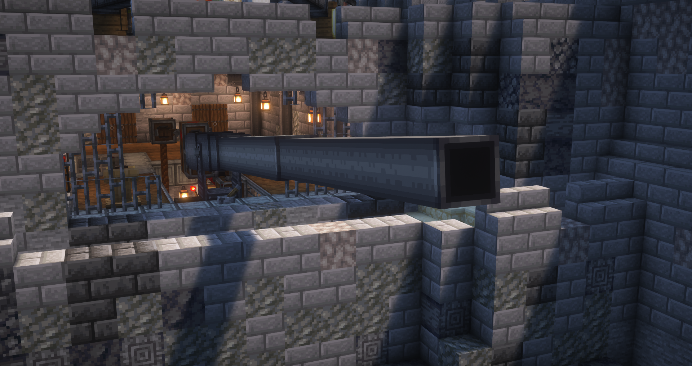
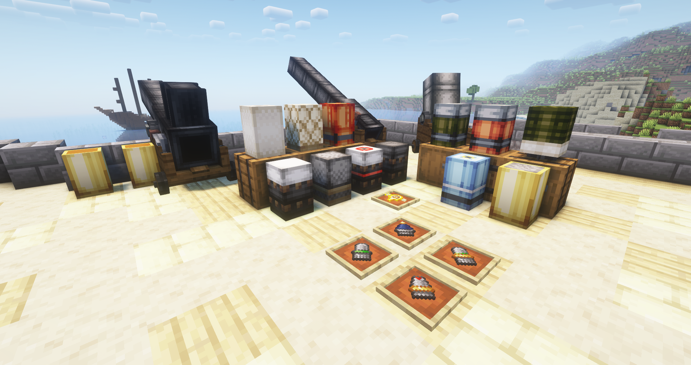
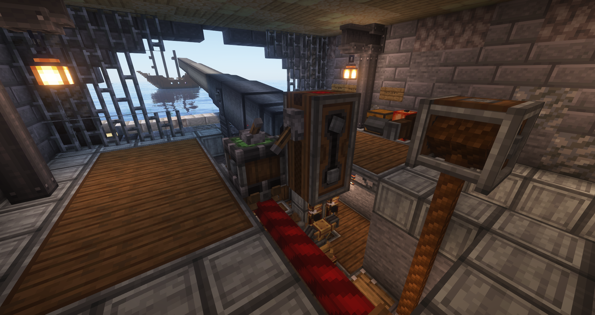
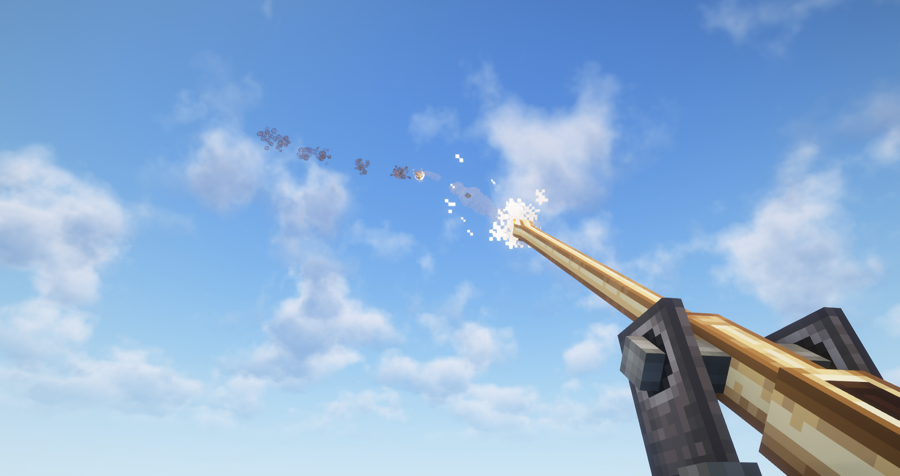

# Create Big Cannons

<h3> <a href="https://www.curseforge.com/minecraft/mc-mods/create-big-cannons"> <strong style="color: #f16436"> DOWNLOAD </strong> </a> </h3>

<strong>Create Big Cannons</strong> is an addon for Create that is about building big cannons that work with Create.

 

<h4><strong>What's added?</strong></h4>

Create Big Cannons (CBC) has:

<ul>
<li>Multiblock big cannons, built out of various cannon blocks with different materials of different tiers</li>
<li>Multiblock autocannons, for faster fire rate and more capabilties, coming in a variety of materials of different tiers</li>
<li>A menagerie of projectiles to wreak destruction with</li>
<li>Kinetic-powered cannon mechanisms to load and aim your cannons</li>
<li>Different fuze items to set off certain projectiles in various ways</li>
<li>A crafting system to build multiblock cannons using Create's kinetic system and a multiblock casting system</li>
<li>Loads of configuration, with many configuration options and datapack configurations</li>
<li>Effects to knock you off your feet and inspire terror in your foes</li>
</ul>
 

<h4><strong>What can I use this mod for?</strong></h4>

CBC is mostly meant as a mod for multiplayer PvP servers. Use big cannons to blow up your foes' bases, valuables, and more!

Compatibility with airship mods such as Valkyrien Skies is supported to varying degrees.

 

<h4><strong>What dependencies are required?</strong></h4>

<a href="https://www.curseforge.com/minecraft/mc-mods/create" rel="nofollow">Create</a> is required.

A mod that adds bronze and steel is needed to access the bronze and steel cannon materials. <a href="https://www.curseforge.com/minecraft/mc-mods/ingotcraft" rel="nofollow">IngotCraft</a> is the recommended mod. This is planned to change in the future.

<strong>Will older versions be supported?</strong>

No, But Porting is allowed; see <a href=https://github.com/Cannoneers-of-Create/CreateBigCannons/blob/1.18.2/dev/LICENSE.md>the license</a> for more info.

 

An rbasamoyai mod.

### Licensing

---

Parts of Create Big Cannons' source and assets are licensed under the MIT license,
while others are licensed under the CC BY-NC-SA license. See [LICENSE.md](LICENSE.md)
for details.

Create Big Cannons copies some code from Create, which is licensed under the MIT
license. See [Create's LICENSE](https://github.com/Creators-of-Create/Create/blob/mc1.18/dev/LICENSE)
for details.

Create Big Cannons depends on code from Ritchie's Projectile Library, which is
licensed under the MIT license. See [RPL's LICENSE](https://github.com/Wagers-of-Industrial-Warfare/RitchiesProjectileLib/blob/1.18.2/dev/LICENSE)
for details.

Create Big Cannons derives some of its textures from Create, which is licensed under the MIT
license. See [Create's LICENSE](https://github.com/Creators-of-Create/Create/blob/mc1.18/dev/LICENSE)
for details.
